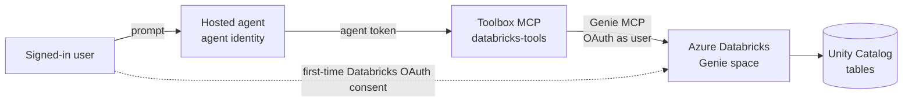

# What this sample demonstrates

A Foundry **hosted agent** that answers natural-language questions over an **Azure Databricks Genie**
space **on behalf of the signed-in user**, and publishes to Microsoft Teams on the Foundry auto-bot.
Agent Framework, Responses protocol.

## How it works

A hosted container authenticates to Foundry with its **own agent identity**, so it can't hold the
user's Databricks token (Entra `UserEntraToken` passthrough won't work here). Instead this agent calls
a **Foundry Toolbox** wrapping the **Azure Databricks Genie** remote MCP tool over an **OAuth
identity-passthrough** connection: Foundry performs the Databricks OAuth consent + token handling
server-side, per user, so Genie runs under the caller's identity and honors Unity Catalog permissions.
See [`main.py`](agent-framework-agent-with-foundry-toolbox-responses/src/agent-framework-agent-databricks/main.py).



Publishing to Teams goes through the repo's APIM bridge like any hosted agent; the bridge is
auth-transparent (consent + OBO happen server-side).

## Prerequisites

1. The **Managed MCP Servers** preview enabled in your Azure Databricks workspace, and a **Genie space**.
2. A **custom OAuth application** registered in your Databricks account (client id + secret).
3. An existing Foundry project with a model deployment (e.g. `gpt-4.1`).
4. **Python 3.12+.**
5. **Additional Azure resources:** the `AzureDatabricksGenieOBO` connection + `databricks-tools`
   toolbox — created with the setup script under Option 1.
6. **Access:** the calling user has access to the Genie space + Unity Catalog tables, and **Foundry
   User** + **Foundry Agent Consumer** on the project.

Placeholders used below: `<SUBSCRIPTION_ID>`, `<RESOURCE_GROUP>`, `<FOUNDRY_ACCOUNT>`, `<PROJECT>`,
`<workspace-host>`, `<space-id>`, `<DATABRICKS_OAUTH_CLIENT_ID>` / `<DATABRICKS_OAUTH_SECRET>`,
`<APIM_NAME>`.

## Option 1: Azure Developer CLI (`azd`)

**Install:** `azd` 1.27.1+, then `azd ext install microsoft.foundry`; sign in with
`azd auth login --tenant-id <id>` and `az login --tenant <id>`.

### Create the connection + toolbox (once)

[`setup/Create-Connection-And-Toolbox.ps1`](setup/Create-Connection-And-Toolbox.ps1) creates the OAuth
identity-passthrough connection and the toolbox, and prints Foundry's reply URL to register on your
Databricks OAuth app — the *MCP OAuth Identity Passthrough* scenario from the
[foundry-samples guide](https://github.com/microsoft-foundry/foundry-samples/blob/main/samples/python/hosted-agents/SUPPORTED_TOOLBOX_SCENARIOS/tools/mcp-oauth-custom.md):

```powershell
./setup/Create-Connection-And-Toolbox.ps1 `
  -ProjectEndpoint https://<FOUNDRY_ACCOUNT>.services.ai.azure.com/api/projects/<PROJECT> `
  -WorkspaceHost <workspace-host> -GenieSpaceId <space-id> `
  -DatabricksClientId <DATABRICKS_OAUTH_CLIENT_ID> -DatabricksClientSecret <DATABRICKS_OAUTH_SECRET> `
  -SubscriptionId <SUBSCRIPTION_ID> -ResourceGroup <RESOURCE_GROUP> `
  -AccountName <FOUNDRY_ACCOUNT> -ProjectName <PROJECT>
```

> Databricks is a **third-party** OAuth provider, so the connection uses the Databricks
> authorize/token URLs (`/oidc/v1/...`) and scopes — confirm them for your workspace. Foundry's reply
> URL must be registered on the **Databricks** OAuth app (the script prints it; you register it in the
> Databricks account console). Portal alternative: Tools → Azure Databricks Genie → Connect.

### Initialize and deploy the agent

```powershell
$PROJECT_ID = "/subscriptions/<SUBSCRIPTION_ID>/resourceGroups/<RESOURCE_GROUP>/providers/Microsoft.CognitiveServices/accounts/<FOUNDRY_ACCOUNT>/projects/<PROJECT>"

azd ai agent init -m agent-framework-agent-with-foundry-toolbox-responses/azure.yaml `
  --project-id $PROJECT_ID --model-deployment gpt-4.1 --no-prompt --force -e databricks
azd env set enableHostedAgentVNext true -e databricks
# In the scaffolded agent.yaml, replace any ${{VAR}} with single-brace ${VAR}
azd up -e databricks
```

### Invoke the deployed agent

```powershell
azd ai agent invoke --new-session "How many customers churned last quarter for Vantia Retail?" --timeout 120
```

The first call returns a **Databricks OAuth consent** URL — sign in and approve as a user with access
to the Genie space, then re-invoke. To confirm per-user trimming, ask as a user *without* access to
the tables and verify the data isn't returned.

## Option 2: VS Code (Foundry Toolkit)

1. Install the **Foundry Toolkit** VS Code extension and `az login`.
2. Open `agent-framework-agent-with-foundry-toolbox-responses/`, run locally (`azd ai agent run` or
   `python main.py`, port 8088), and chat via **Foundry Toolkit: Open Agent Inspector**.
3. Run **Foundry Toolkit: Deploy Hosted Agent** to build, register the version, and assign RBAC.

(The connection + toolbox from Option 1 are still required — create them first.)

## Publish to Teams

The Foundry auto-bot is preserved; publish through the repo's APIM bridge:

```powershell
./scripts/Publish-AgentToTeams.ps1 -ResourceGroup <RESOURCE_GROUP> `
  -AgentName agent-framework-agent-databricks `
  -ProjectEndpoint https://<FOUNDRY_ACCOUNT>.services.ai.azure.com/api/projects/<PROJECT> -ApimName <APIM_NAME>
```

Open the agent in Teams, complete the first-time Databricks sign-in/consent, and ask.

## Troubleshooting

| Symptom | Cause / fix |
| --- | --- |
| Agent returns no tools | Toolbox name/`TOOLBOX_NAME` mismatch, or no default version. Check `azd ai toolbox show databricks-tools`. |
| Consent URL every call | Consent not completed, or the refresh token expired. Complete the consent URL. |
| Tool returns `401` / `403` | Check the agent-to-toolbox identity **and** the downstream OAuth app / Genie space permissions — separate boundaries. |
| Startup / readiness fails | Ensure `enableHostedAgentVNext=true` and `AZURE_AI_MODEL_DEPLOYMENT_NAME` matches a real deployment. |
| Genie returns nothing but no error | The signed-in user lacks access to the Genie space or underlying Unity Catalog tables. |

## Next steps

- [Use Azure Databricks Genie in Microsoft Foundry](https://learn.microsoft.com/azure/databricks/integrations/microsoft-foundry)
- [Use a toolbox with a hosted agent](https://learn.microsoft.com/azure/foundry/agents/how-to/tools/use-toolbox-hosted-agent)
- Sibling routes: [`../sharepoint-agent-workiq`](../sharepoint-agent-workiq/README.md) · [`../sharepoint-agent-copilot-retrieval`](../sharepoint-agent-copilot-retrieval/README.md)
