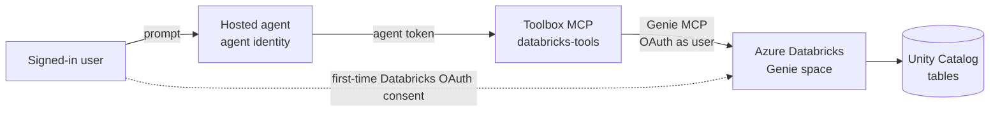

# Azure Databricks Genie from a Foundry **hosted agent** (OBO / user-identity route)

This is the **hosted-agent** version of the `agent-databricks-OBO` portal agent. It lets a
Foundry *hosted* agent answer natural-language questions over an **Azure Databricks Genie**
space **on behalf of the signed-in user**, and still publish the agent to Microsoft Teams.

> This scaffold mirrors the **verified** SharePoint hosted-agent route in
> [`../sharepoint-agent-workiq`](../sharepoint-agent-workiq/README.md). The identity mechanics
> are the same (a toolbox-wrapped MCP tool + server-side OAuth consent), so a hosted container
> can complete the user delegation that a portal agent does interactively.

## TL;DR — what works and why

| Layer | Use this | Not this |
| --- | --- | --- |
| Databricks access | **Azure Databricks Genie** remote MCP tool in a **toolbox** | app-only / static token to Databricks |
| Auth | **OAuth identity passthrough** (Databricks custom OAuth app) → Foundry holds the user token server-side | Entra `UserEntraToken` passthrough (hosted container can't satisfy it) |
| Runtime | `set_resilient_tasks_enabled(True)` in `main.py` | default (server_error on `store=true`) |
| Consent UX | native `oauth_consent_request` sign-in card (consent patch in `main.py`) | raw error blob in Teams |

## Why a toolbox (and not the tool directly on a hosted agent)

The portal agent attaches the **Azure Databricks Genie** tool via the `AzureDatabricksGenieOBO`
connection and, on first use, shows an **Open consent → sign in to Azure Databricks → Approve**
flow. A *hosted* agent's container authenticates to Foundry with its **own agent identity**, so
it can't hold the user's Databricks token itself. Putting Genie behind a **Toolbox** lets Foundry
perform the OAuth consent + token handling **server-side, per user**, while the hosted runtime
preserves the caller's context — so user-delegated Genie calls work, including after Teams publish.

## Architecture



**Published to Teams** goes through the repo's APIM bridge exactly like the SharePoint agent; the
bridge only carries the activity-protocol transport and is **auth-transparent** (consent + OBO
happen server-side in Foundry).

## Prerequisites

- The **Managed MCP Servers** preview is enabled in your Azure Databricks workspace.
- A **Genie Agent / space** exists (this is the "Vantia Retail customer churn" space).
- A **custom OAuth application** is registered in your Azure Databricks account (client id + secret).
- The `AzureDatabricksGenieOBO` **project connection** already exists in the Foundry project
  (remote MCP, **OAuth identity passthrough**) — you created it when you built the portal agent.
- Tooling: `az`, `azd` >= 1.25 with the `microsoft.foundry` / `azure.ai.*` extensions, signed in
  to the correct tenant (`az login --tenant <id>`, `azd auth login --tenant-id <id>`).

Placeholders — substitute your own values:

| Placeholder | Meaning / example |
| --- | --- |
| `<SUBSCRIPTION_ID>` | Azure subscription of the Foundry account |
| `<RESOURCE_GROUP>` | Resource group of the Foundry account, e.g. `rg-foundry-agents` |
| `<FOUNDRY_ACCOUNT>` | Foundry (AI Services) account name |
| `<PROJECT>` | Foundry project name |
| `<APIM_NAME>` | APIM bridge name for Teams publish (see repo `infra/`) |

---

## Step 1 — Confirm the Databricks Genie connection

The portal agent already uses a connection named **`AzureDatabricksGenieOBO`** (remote MCP,
OAuth identity passthrough). Reuse it. If you need to (re)create it, add the **Azure Databricks
Genie** tool in the Foundry portal (**Tools → Azure Databricks Genie → Connect**) with:

- **Remote MCP Server endpoint**: your Genie space MCP endpoint,
  e.g. `https://<workspace-host>/api/2.0/mcp/genie/<space-id>`
- **Authentication**: OAuth identity passthrough
- **Client ID / Client secret**: from your Databricks custom OAuth app

Ref: [Use Azure Databricks Genie in Microsoft Foundry](https://learn.microsoft.com/azure/databricks/integrations/microsoft-foundry).

---

## Step 2 — Create the toolbox

The toolbox bundles the Genie MCP tool behind one MCP endpoint. See
[`agent-framework-agent-with-foundry-toolbox-responses/toolbox.yaml`](agent-framework-agent-with-foundry-toolbox-responses/toolbox.yaml)
(it references `AzureDatabricksGenieOBO`).

```powershell
azd ai project set https://<FOUNDRY_ACCOUNT>.services.ai.azure.com/api/projects/<PROJECT>

cd agent-framework-agent-with-foundry-toolbox-responses
azd ai toolbox create databricks-tools --from-file toolbox.yaml
# The first version becomes the default automatically.
azd ai toolbox show databricks-tools --output json
```

The agent consumes the toolbox at:
`https://<FOUNDRY_ACCOUNT>.services.ai.azure.com/api/projects/<PROJECT>/toolboxes/databricks-tools/mcp?api-version=v1`

---

## Step 3 — Deploy the hosted agent (azd)

The agent code is [`agent-framework-agent-with-foundry-toolbox-responses`](agent-framework-agent-with-foundry-toolbox-responses/).
It connects to the toolbox with its own agent identity; Genie supplies the per-user identity.

```powershell
$PROJECT_ID = "/subscriptions/<SUBSCRIPTION_ID>/resourceGroups/<RESOURCE_GROUP>/providers/Microsoft.CognitiveServices/accounts/<FOUNDRY_ACCOUNT>/projects/<PROJECT>"

azd ai agent init `
  -m <repo>\foundryagents\hostedagent\databricks-agent\agent-framework-agent-with-foundry-toolbox-responses\azure.yaml `
  --project-id $PROJECT_ID --model-deployment gpt-4.1 --no-prompt --force -e databricks

# Post-init flags (these bite every first deploy)
azd env set enableHostedAgentVNext "true" -e databricks
azd env set AZURE_AI_MODEL_DEPLOYMENT_NAME "gpt-4.1" -e databricks   # match a deployment in your project
azd env set ENABLE_MONITORING "false" -e databricks                 # if the project already has App Insights

# In the scaffolded src/<agent>/agent.yaml, replace any ${{VAR}} with single-brace ${VAR}

azd up -e databricks
```

---

## Step 4 — Test Genie access on behalf of a user

```powershell
azd ai agent invoke --new-session "How many customers churned last quarter for Vantia Retail?" --timeout 120
```

1. The first call returns an **OAuth consent** URL. Open it, **sign in to Azure Databricks** as a
   user with access to the Genie space, and **Approve**.
2. Re-invoke the same question → you get an answer grounded in the Genie space, with the figures
   (and SQL when helpful).
3. **Verify permission trimming:** ask as a user *without* access to the space/tables and confirm
   the data is **not** returned. This proves OBO honors Databricks permissions.

---

## Step 5 — Publish to Teams (with the APIM bridge)

Same as any hosted agent in this repo — the APIM bridge carries the activity transport to the
private Foundry endpoint; consent + OBO stay server-side.

```powershell
# From the repo root
./scripts/Publish-AgentToTeams.ps1 `
  -ResourceGroup <RESOURCE_GROUP> `
  -AgentName agent-framework-agent-databricks `
  -ProjectEndpoint https://<FOUNDRY_ACCOUNT>.services.ai.azure.com/api/projects/<PROJECT> `
  -ApimName <APIM_NAME>
```

Then in Teams: open the agent, ask a churn question, complete the **first-time Databricks
sign-in/consent**, and re-ask.

---

## Troubleshooting

| Symptom | Cause / fix |
| --- | --- |
| Agent returns no tools | Toolbox name/`TOOLBOX_NAME` mismatch, or no default version. Check `azd ai toolbox show databricks-tools`. |
| `oauth_consent_required` / consent URL every call | User hasn't completed the Databricks consent, or the refresh token expired. Complete the consent URL. |
| Tool returns `401` / `403` | Check the agent-to-toolbox identity **and** the downstream OAuth app / Genie space permissions — separate boundaries. |
| Startup / readiness fails | Ensure `enableHostedAgentVNext=true` and `AZURE_AI_MODEL_DEPLOYMENT_NAME` matches a real deployment. |
| Genie returns nothing but no error | The signed-in user lacks access to the Genie space or underlying Unity Catalog tables. |

## Layout

```
databricks-agent/
├── README.md                                    ← this file
└── agent-framework-agent-with-foundry-toolbox-responses/
    ├── azure.yaml                               ← model + hosted agent (azd)
    ├── toolbox.yaml                             ← Databricks Genie toolbox definition
    └── src/agent-framework-agent-databricks/
        ├── main.py                              ← agent (toolbox consumer, responses protocol)
        ├── requirements.txt
        ├── Dockerfile
        └── .env.example
```

## References

- [Use Azure Databricks Genie in Microsoft Foundry](https://learn.microsoft.com/azure/databricks/integrations/microsoft-foundry)
- [Available managed MCP servers (Databricks)](https://learn.microsoft.com/azure/databricks/agents/mcp-tools/managed-mcp#available-managed-servers)
- [Create and use a Foundry Toolbox](https://learn.microsoft.com/azure/foundry/agents/how-to/tools/toolbox)
- [Use a toolbox with a hosted agent](https://learn.microsoft.com/azure/foundry/agents/how-to/tools/use-toolbox-hosted-agent)
- [How toolbox authentication works](https://learn.microsoft.com/azure/foundry/agents/how-to/tools/tool-authentication)
- Sibling route (verified): [`../sharepoint-agent-workiq`](../sharepoint-agent-workiq/README.md)
