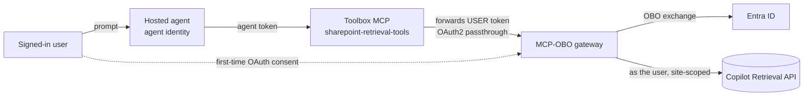

# What this sample demonstrates

A Foundry **hosted agent** that answers questions grounded in **one SharePoint site**, trimmed to each
signed-in user's permissions, and publishable to Microsoft Teams on the Foundry auto-bot — no custom
bot. It reaches SharePoint through the repo's **[MCP-OBO gateway](../../mcp-obo-gateway/README.md)**.
Agent Framework, Responses protocol.

## How it works

A hosted container runs as its **own agent identity**, so it can't hold the user's token — which is why
the native `sharepoint_grounding_preview` tool fails app-only in a hosted agent. Instead this agent
calls a **Foundry Toolbox** wrapping an **OAuth2 identity-passthrough** connection to the gateway:
Foundry brokers the user's token server-side, the gateway does the **On-Behalf-Of** exchange and calls
the **Microsoft 365 Copilot Retrieval API** as the user (site-scoped via `filterExpression`). See
[`main.py`](agent-framework-agent-with-foundry-toolbox-responses/src/agent-framework-agent-sharepoint-copilot-retrieval/main.py).



Publishing to Teams goes through the repo's APIM bridge like any hosted agent; the bridge is
auth-transparent (consent + OBO happen server-side, and the gateway call is a separate outbound leg).

## Prerequisites

1. The **MCP-OBO gateway deployed** and reachable from your Foundry project — see
   [`../../mcp-obo-gateway/README.md`](../../mcp-obo-gateway/README.md); register its Entra app with
   [`../../../scripts/Register-GatewayApp.ps1`](../../../scripts/Register-GatewayApp.ps1).
2. An existing Foundry project with a model deployment (e.g. `gpt-4.1`).
3. **Python 3.12+.**
4. **Additional Azure resources:** the `SharePointRetrievalOBO` connection + `sharepoint-retrieval-tools`
   toolbox — created with the setup script under Option 1.
5. **Roles (RBAC):** the calling user has **Foundry User** + **Foundry Agent Consumer** on the project.
6. **Licensing:** a **Microsoft 365 Copilot** license for the users, or **Retrieval API pay-as-you-go**
   (which needs ≥1 Copilot license in the tenant) — otherwise the tool returns `403 … valid license`.

Placeholders used below: `<SUBSCRIPTION_ID>`, `<RESOURCE_GROUP>`, `<FOUNDRY_ACCOUNT>`, `<PROJECT>`,
`<GATEWAY_HOST>` (deployed gateway host), `<GATEWAY_APP_ID>` / `<GATEWAY_SECRET>` (from
`Register-GatewayApp.ps1`), `<APIM_NAME>` (APIM bridge).

## Option 1: Azure Developer CLI (`azd`)

**Install:** `azd` 1.27.1+, then `azd ext install microsoft.foundry`; sign in with
`azd auth login --tenant-id <id>` and `az login --tenant <id>`.

### Create the connection + toolbox (once)

[`setup/Create-Connection-And-Toolbox.ps1`](setup/Create-Connection-And-Toolbox.ps1) creates the OAuth2
identity-passthrough connection, registers Foundry's reply URL on the gateway app, and creates the
toolbox — the *MCP OAuth Identity Passthrough* scenario from the
[foundry-samples guide](https://github.com/microsoft-foundry/foundry-samples/blob/main/samples/python/hosted-agents/SUPPORTED_TOOLBOX_SCENARIOS/tools/mcp-oauth-custom.md):

```powershell
./setup/Create-Connection-And-Toolbox.ps1 `
  -ProjectEndpoint https://<FOUNDRY_ACCOUNT>.services.ai.azure.com/api/projects/<PROJECT> `
  -GatewayHost <GATEWAY_HOST> -GatewayAppId <GATEWAY_APP_ID> -GatewayClientSecret <GATEWAY_SECRET> `
  -SubscriptionId <SUBSCRIPTION_ID> -ResourceGroup <RESOURCE_GROUP> `
  -AccountName <FOUNDRY_ACCOUNT> -ProjectName <PROJECT>
```

> Prefer the portal? Create the connection (Tools → custom MCP → OAuth2, Custom OAuth) and the toolbox
> in the Foundry Toolkit instead. Either way, Foundry's per-connection reply URL **must** be registered
> on the gateway app or the first consent fails with a `redirect_uri` mismatch (the script does this).

### Initialize and deploy the agent

```powershell
$PROJECT_ID = "/subscriptions/<SUBSCRIPTION_ID>/resourceGroups/<RESOURCE_GROUP>/providers/Microsoft.CognitiveServices/accounts/<FOUNDRY_ACCOUNT>/projects/<PROJECT>"

azd ai agent init -m agent-framework-agent-with-foundry-toolbox-responses/azure.yaml `
  --project-id $PROJECT_ID --model-deployment gpt-4.1 --no-prompt --force -e sharepoint-retrieval
azd env set enableHostedAgentVNext true -e sharepoint-retrieval
# In the scaffolded agent.yaml, replace any ${{VAR}} with single-brace ${VAR}
azd up -e sharepoint-retrieval
```

### Invoke the deployed agent

```powershell
azd ai agent invoke --new-session "What does our onboarding guide say about MFA setup?" --timeout 120
```

The first call returns an **OAuth consent** URL — approve as a Copilot-licensed user with access to the
site, then re-invoke. To confirm per-user trimming, ask as a user *without* access to a document and
verify it isn't returned.

## Option 2: VS Code (Foundry Toolkit)

1. Install the **Foundry Toolkit** VS Code extension and `az login`.
2. Open `agent-framework-agent-with-foundry-toolbox-responses/`, run locally (`azd ai agent run` or
   `python main.py`, port 8088), and chat via **Foundry Toolkit: Open Agent Inspector**.
3. Run **Foundry Toolkit: Deploy Hosted Agent** to build, register the version, and assign RBAC.

(The connection + toolbox from Option 1 are still required — create them first.)

## Publish to Teams

The Foundry auto-bot is preserved; publish through the repo's APIM bridge:

```powershell
./scripts/Publish-AgentToTeams.ps1 -ResourceGroup <RESOURCE_GROUP> `
  -AgentName agent-framework-agent-sharepoint-copilot-retrieval `
  -ProjectEndpoint https://<FOUNDRY_ACCOUNT>.services.ai.azure.com/api/projects/<PROJECT> -ApimName <APIM_NAME>
```

Open the agent in Teams, complete the one-time consent, and ask.

## Troubleshooting

| Symptom | Cause / fix |
| --- | --- |
| Agent returns no tools | Toolbox name/`TOOLBOX_NAME` mismatch, or no default version. Check `azd ai toolbox show sharepoint-retrieval-tools`. |
| Consent URL every call | Consent not completed, or the connection token expired. Complete the consent URL. |
| `401` at the gateway | Forwarded token isn't OBO-able — check the connection scope (`api://<GATEWAY_APP_ID>/access_as_user`) and that the gateway app issues v2 tokens. |
| `403 … Files.Read.All/Sites.Read.All` | Gateway app missing/ungranted Graph delegated permissions — re-run `Register-GatewayApp.ps1`. |
| `403 … valid license` | User isn't Copilot-licensed and Retrieval API paygo isn't enabled — a licensing gate, not code. |
| Startup / readiness fails | Ensure `enableHostedAgentVNext=true` and `AZURE_AI_MODEL_DEPLOYMENT_NAME` matches a real deployment. |

## Next steps

- MCP-OBO gateway (server + setup): [`../../mcp-obo-gateway/README.md`](../../mcp-obo-gateway/README.md)
- [Microsoft 365 Copilot Retrieval API](https://learn.microsoft.com/microsoft-365/copilot/extensibility/api/ai-services/retrieval/overview)
- [Use a toolbox with a hosted agent](https://learn.microsoft.com/azure/foundry/agents/how-to/tools/use-toolbox-hosted-agent)
- Sibling routes: [`../sharepoint-agent-workiq`](../sharepoint-agent-workiq/README.md) · [`../databricks-agent`](../databricks-agent/README.md)
