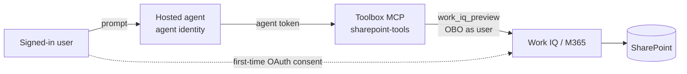
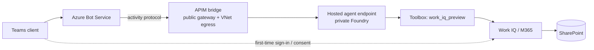

# SharePoint access from a Foundry **hosted agent** (Work IQ toolbox / user-identity route)

This is the **prescribed, working route** for letting a Foundry *hosted* agent read
SharePoint (and other Microsoft 365) content **on behalf of the signed-in user**, and
still publish the agent to Microsoft Teams.

> **Status: ✅ verified end-to-end** — a VNet-injected hosted agent returned a real SharePoint
> document summary on behalf of the signed-in user, both in the Foundry playground and in
> Microsoft Teams (via the APIM bridge) against a fully **private** Foundry project.

## TL;DR — what works and why

| Layer | Use this | Not this |
| --- | --- | --- |
| SharePoint access | **Work IQ `work_iq_preview`** in a **toolbox** (OAuth2 consent) | `sharepoint_grounding_preview` (app-only) · SharePoint MCP `UserEntraToken` |
| Auth | **Interactive OAuth consent** → Foundry holds the user token server-side | agent identity / CLI invoke (no delegated user context) |
| Licensing | **Copilot Credits / usage-based billing** (Work IQ API) | *(nothing = "unable to retrieve")* |
| Runtime | `set_resilient_tasks_enabled(True)` in `main.py` | default (server_error on `store=true`) |
| Consent UX | native `oauth_consent_request` sign-in card (a2a_preview backport in `main.py`) | raw error blob in Teams |

## Why this route (and not the SharePoint grounding tool)

The built-in `sharepoint_grounding_preview` tool does **not** work from a hosted agent
published to Teams:

- A hosted agent's container authenticates to Foundry with its **own agent identity**
  (managed identity), so the grounding tool sees an **app-only** token — and SharePoint
  grounding explicitly rejects app-only auth.
- The tool is also **explicitly unsupported when the agent is published to Microsoft Teams**.

Instead, put SharePoint/M365 behind **Work IQ inside a Toolbox**, using an **OAuth2
identity-passthrough connection**. Foundry performs the On-Behalf-Of (OBO) token exchange
**server-side, per user**, and the hosted runtime preserves the caller's context — so
user-delegated calls work, including after Teams publish (users sign in on first use).

## Architecture

**Playground / direct call (verified):**



**Published to Teams (via the APIM bridge in this repo):**



The APIM bridge only carries the **activity-protocol transport** to the private Foundry
endpoint; it is **auth-transparent**. The user delegation (consent + OBO) happens
**server-side in Foundry** exactly as it does in the playground.


## Prerequisites

- The **Foundry project, the SharePoint site, and the test users are all in the same
  Microsoft Entra tenant** (cross-tenant OBO is not supported).
- Each calling user has a **Microsoft 365 Copilot license**, or the tenant has
  **Copilot Credits usage-based billing** enabled.
- Azure roles on the Foundry project: **Foundry User** (developer, agent runtime identity,
  and OAuth users) and **Foundry Project Manager** (to create the connection).
- Tooling: `az`, `azd` >= 1.25 with the `microsoft.foundry` / `azure.ai.*` extensions,
  signed in to the correct tenant (`az login --tenant <id>`, `azd auth login --tenant-id <id>`).
- A **Global Administrator** for the one-time tenant setup in Step 1 (activate via PIM,
  deactivate after).

Placeholders used throughout this guide — substitute your own values:

| Placeholder | Meaning |
| --- | --- |
| `<TENANT_ID>` | Your Microsoft Entra tenant ID |
| `<SUBSCRIPTION_ID>` | Azure subscription (same tenant as the Foundry project) |
| `<RESOURCE_GROUP>` | Resource group of the Foundry account |
| `<FOUNDRY_ACCOUNT>` | Foundry (AI Services) account name |
| `<PROJECT>` | Foundry project name |
| `<BYO_APP_CLIENT_ID>` | App (client) ID of the BYO Entra app you register in Step 1 |
| `<APIM_NAME>` | APIM bridge name (Teams publish; see repo `infra/`) |

Microsoft-owned constants — use as-is:

| Item | Value |
| --- | --- |
| Work IQ resource app ID | `fdcc1f02-fc51-4226-8753-f668596af7f7` |
| `WorkIQAgent.Ask` scope ID | `0b1715fd-f4bf-4c63-b16d-5be31f9847c2` |
| Work IQ “Agent Tools” audience | `ea9ffc3e-8a23-4a7d-836d-234d7c7565c1` |

---

## Step 0 — Copilot licensing / Credits (REQUIRED for retrieval)

Work IQ retrieval over SharePoint/M365 is gated on Microsoft 365 Copilot entitlement. The
agent can authenticate as the user and call Work IQ, but retrieval returns nothing unless the
**calling user** is covered by one of:

- A per-user **Microsoft 365 Copilot license**, **or**
- Tenant **Copilot Credits / usage-based billing** connected to the **Work IQ API** (and the
  underlying **Microsoft 365 Copilot Retrieval API**).

Symptom when this is missing: the agent replies *"unable to retrieve the file"* even though
consent/sign-in succeeded — an auth **success** but a licensing/retrieval failure.

### Enable Copilot Credits (pay-as-you-go) — no per-seat license needed

Roles: **Billing Administrator**, **AI Administrator**, or **Global Administrator**. You also
need an **Azure subscription in the same tenant** and a resource group.

1. Microsoft 365 admin center → **Copilot** → **Cost management** (usage-based billing).
2. Create/enable a policy (the setup wizard):
   - **User and group access:** All users (or a group containing the test users).
   - **Agents and services:** ensure **Work IQ API** is included (Copilot Cowork appears too).
   - **Billing method:** Pay-as-you-go, pick your Azure subscription.
   - **Monthly spending limit:** e.g. 500 credits/month.
   - **Activate** the policy.
3. (If your tenant exposes it separately) Microsoft 365 admin center → **Billing** →
   **Pay-as-you-go** → **Services** → connect a billing policy to **Microsoft 365 Copilot
   Retrieval API**.
4. **Wait ~2 hours** for propagation. Per Microsoft's docs the **first** call after enabling
   may fail — retry and it succeeds.

Verify billing works cheaply: have an eligible user ask a Coach agent (e.g. "Learning Coach")
*"What can you do?"* (~12 credits), then check the Copilot Credits report.

Docs: [Retrieval API pay-as-you-go](https://learn.microsoft.com/microsoft-365/copilot/extensibility/api/ai-services/retrieval/paygo-retrieval) ·
[Usage-based billing / Copilot Credits](https://learn.microsoft.com/microsoft-365/copilot/usage-based-billing-overview-copilot-credits)

---

## Step 1 — One-time Work IQ tenant setup (Global Admin)

Provision the Work IQ service principal, register a bring-your-own (BYO) Entra app, add the
`WorkIQAgent.Ask` delegated permission, and grant tenant-wide admin consent.

```powershell
# 1a. Provision the Microsoft Work IQ service principal in your tenant
az ad sp create --id fdcc1f02-fc51-4226-8753-f668596af7f7

# 1b. Discover the WorkIQAgent.Ask delegated scope id (value = WorkIQAgent.Ask)
az ad sp show --id fdcc1f02-fc51-4226-8753-f668596af7f7 `
  --query "oauth2PermissionScopes[?value=='WorkIQAgent.Ask'].id" -o tsv

# 1c. Register a single-tenant BYO app for the Foundry Work IQ OAuth2 connection
az ad app create --display-name "Foundry WorkIQ OBO - sharepoint-agent" `
  --sign-in-audience AzureADMyOrg --query "{appId:appId}" -o json

# 1d. Add the WorkIQAgent.Ask delegated permission and create the app's service principal
az ad app permission add --id <APP_ID> `
  --api fdcc1f02-fc51-4226-8753-f668596af7f7 `
  --api-permissions 0b1715fd-f4bf-4c63-b16d-5be31f9847c2=Scope
az ad sp create --id <APP_ID>

# 1e. Grant tenant-wide admin consent for WorkIQAgent.Ask
az ad app permission admin-consent --id <APP_ID>

# 1f. Verify the grant (expect consentType=AllPrincipals, scope=WorkIQAgent.Ask)
az rest --method GET `
  --url "https://graph.microsoft.com/v1.0/oauth2PermissionGrants?`$filter=clientId eq '<APP_SP_OBJECT_ID>'" `
  --query "value[].{consentType:consentType, scope:scope}" -o json
```

Create a **client secret** on the BYO app (store it in Key Vault; never commit it):

```powershell
az ad app credential reset --id <APP_ID> --display-name workiq-secret --years 1
# copy the "password" value into a secure store
```

---

## Step 2 — Create the SharePoint connection (CLI)

Point `azd ai` at the project, then create the dedicated Work IQ **SharePoint MCP**
connection. It uses `UserEntraToken` (identity passthrough) so the signed-in user's
identity reaches SharePoint — **no client secret is needed** for this connection.

```powershell
azd ai project set https://<FOUNDRY_ACCOUNT>.services.ai.azure.com/api/projects/<PROJECT>

azd ai connection create sharepoint-workiq-conn `
  --kind remote-tool `
  --target https://agent365.svc.cloud.microsoft/agents/servers/mcp_SharePointRemoteServer `
  --auth-type user-entra-token `
  --audience ea9ffc3e-8a23-4a7d-836d-234d7c7565c1
```

> **Fallback route — general M365 via Work IQ A2A (needs the BYO app + secret from Step 1).**
> Only needed if you want broader M365 reasoning beyond SharePoint grounding. Run this
> yourself so the secret isn't logged (prefer `--client-secret $env:WIQ_SECRET`):
>
> ```powershell
> azd ai connection create workiq-conn `
>   --kind remote-a2a `
>   --target https://workiq.svc.cloud.microsoft/a2a/ `
>   --auth-type oauth2 `
>   --authorization-url https://login.microsoftonline.com/<TENANT_ID>/oauth2/v2.0/authorize `
>   --token-url https://login.microsoftonline.com/<TENANT_ID>/oauth2/v2.0/token `
>   --client-id <BYO_APP_CLIENT_ID> `
>   --client-secret $env:WIQ_SECRET `
>   --scopes "api://workiq.svc.cloud.microsoft/WorkIQAgent.Ask offline_access"
> ```
> After creation, if a redirect URL is returned, add it to the BYO app registration under
> **Authentication → Add a platform → Web → Redirect URIs**.

---

## Step 3 — Create the toolbox

The toolbox bundles the SharePoint MCP tool behind one MCP endpoint. See
[`agent-framework-agent-with-foundry-toolbox-responses/toolbox.yaml`](agent-framework-agent-with-foundry-toolbox-responses/toolbox.yaml)
(it references `sharepoint-workiq-conn`).

```powershell
cd agent-framework-agent-with-foundry-toolbox-responses
azd ai toolbox create sharepoint-tools --from-file toolbox.yaml
# The first version becomes the default automatically.
azd ai toolbox show sharepoint-tools --output json
```

The agent consumes the toolbox at:
`https://<FOUNDRY_ACCOUNT>.services.ai.azure.com/api/projects/<PROJECT>/toolboxes/sharepoint-tools/mcp?api-version=v1`

---

## Step 4 — Deploy the hosted agent (azd)

The agent code is [`agent-framework-agent-with-foundry-toolbox-responses`](agent-framework-agent-with-foundry-toolbox-responses/).
It connects to the toolbox with its own agent identity; Work IQ supplies the per-user identity.

```powershell
# From an empty working directory for the azd project
$PROJECT_ID = "/subscriptions/<SUBSCRIPTION_ID>/resourceGroups/<RESOURCE_GROUP>/providers/Microsoft.CognitiveServices/accounts/<FOUNDRY_ACCOUNT>/projects/<PROJECT>"

azd ai agent init `
  -m <repo>\foundryagents\hostedagent\sharepoint-agent-workiq\agent-framework-agent-with-foundry-toolbox-responses\azure.yaml `
  --project-id $PROJECT_ID --model-deployment gpt-4.1 --no-prompt --force -e sharepoint

# Post-init flags (these bite every first deploy)
azd env set enableHostedAgentVNext "true" -e sharepoint
azd env set AZURE_AI_MODEL_DEPLOYMENT_NAME "gpt-4.1" -e sharepoint       # match a deployment in your project
azd env set ENABLE_MONITORING "false" -e sharepoint                    # if the project already has App Insights

# In the scaffolded src/<agent>/agent.yaml, replace any ${{VAR}} with single-brace ${VAR}

azd up -e sharepoint
```

---

## Step 5 — Test SharePoint access on behalf of a user

```powershell
azd ai agent invoke --new-session "Summarize the latest document in the <SiteName> SharePoint site." --timeout 120
```

1. The first call returns an **OAuth consent** URL (Work IQ user delegation). Open it, sign in
   as a **licensed** user with access to the site, and consent.
2. Re-invoke the same question → you get an answer grounded in SharePoint content, with citations.
3. **Verify permission trimming:** ask the same question as a user *without* access to a document
   and confirm that content is **not** returned. This proves OBO honors SharePoint permissions.

---

## Step 6 — Publish to Teams (with the APIM bridge)

**Does the SharePoint/Work IQ flow survive Teams publish? Yes** — the identity mechanics are
identical to the playground, and the APIM bridge in this repo is auth-transparent.

How it fits together:
1. Foundry publish creates an **Azure Bot** whose messaging endpoint targets the agent's
   **activity-protocol** endpoint. For a **private** project, Bot Service can't reach the
   private endpoint directly, so this repo's **APIM bridge** (`infra/` + `scripts/Publish-AgentToTeams.ps1`)
   sits in front: public gateway inbound, VNet egress to the private Foundry endpoint.
2. The platform **auto-bridges Responses → Activity** for M365 channels, so the same hosted
   agent code serves Teams with no changes.
3. On first use in Teams, the user **signs in / consents** (the same Work IQ OAuth consent as
   the playground). Foundry then holds that user's token server-side and runs `work_iq_preview`
   **on their behalf** — permission-trimmed SharePoint retrieval, per user.

Publish it:

```powershell
# From the repo root — creates the bot pointed at the APIM bridge and publishes to Teams/M365
./scripts/Publish-AgentToTeams.ps1 `
  -ResourceGroup <RESOURCE_GROUP> `
  -AgentName agent-framework-agent-sharepoint `
  -ProjectEndpoint https://<FOUNDRY_ACCOUNT>.services.ai.azure.com/api/projects/<PROJECT> `
  -ApimName <APIM_NAME>
```

Then in Teams: open the agent, send *"Summarize '<your-document>.pdf' from my SharePoint,"*
complete the **first-time sign-in/consent**, and re-ask.

### What the APIM bridge does and doesn't touch
- **Does:** forward the Bot Service activity webhook to the private Foundry endpoint (host +
  `api-version` fixups); lets a public, multi-tenant Bot Service reach a VNet-private agent.
- **Doesn't:** participate in identity. Consent + OBO happen between the user, Entra, and Work IQ
  server-side — the bridge never sees or needs the user token.

### Things that must already be true (all done in this guide)
- Copilot Credits / Work IQ API billing enabled (Step 0).
- Work IQ tenant setup + BYO app consent (Step 1).
- Same tenant for project, SharePoint, and users.
- Agent egress can reach Work IQ/M365 (open by default on `agent-subnet`; if you switch to
  default-deny egress, allow `agent365.svc.cloud.microsoft`, `workiq.svc.cloud.microsoft`,
  `login.microsoftonline.com`, `*.consent.azure-apim.net`, `graph.microsoft.com`).

> **Validated:** this exact flow was confirmed working in Microsoft Teams against a fully
> **private** Foundry project (public network access disabled) via the APIM bridge — the agent
> returned a SharePoint document summary on behalf of the signed-in user. The first-time consent
> renders as a native sign-in card (see the a2a_preview backport in `main.py`).


---

## Troubleshooting

| Symptom | Cause / fix |
| --- | --- |
| `AppOnly OBO tokens not supported` / `No CustomKeys connection found` | You're using the SharePoint grounding tool, not the Work IQ toolbox. Use this route. |
| Agent returns no tools | Toolbox name/`TOOLBOX_NAME` mismatch, or no default version. Check `azd ai toolbox show sharepoint-tools`. |
| `oauth_consent_required` / consent URL every call | User hasn't consented yet, or the refresh token expired. Complete the consent URL. |
| `User does not have valid license` | Assign a Microsoft 365 Copilot license or enable Copilot Credits billing. |
| 401 / cross-tenant | The Foundry project and M365/SharePoint must be in the same tenant. |
| Container fails readiness on deploy | Ensure `enableHostedAgentVNext=true` and `AZURE_AI_MODEL_DEPLOYMENT_NAME` matches a real deployment. |

## Layout

```
sharepoint-agent-workiq/
├── README.md                                    ← this file
└── agent-framework-agent-with-foundry-toolbox-responses/
    ├── azure.yaml                               ← model + hosted agent (azd)
    ├── toolbox.yaml                             ← Work IQ toolbox definition
    └── src/agent-framework-agent-sharepoint/
        ├── main.py                              ← agent (toolbox consumer, responses protocol)
        ├── requirements.txt
        ├── Dockerfile
        └── .env.example
```

## References

**Approaches this was based on**
- Blog: [Building Agents that Act on Your Behalf with Toolboxes in Foundry](https://devblogs.microsoft.com/foundry/building-agents-that-act-on-your-behalf-with-toolboxes-in-foundry/) — the toolbox / user-delegation pattern used here.
- Sample (the reference implementation we modeled the agent on): [foundry-samples · agent-framework/responses/07-teams-activity](https://github.com/microsoft-foundry/foundry-samples/tree/main/samples/python/hosted-agents/agent-framework/responses/07-teams-activity).
- Alternative pattern (custom OBO, not used here): [gbelenky/HostedOBOAgent](https://github.com/gbelenky/HostedOBOAgent/tree/main/src/HostedOBOAgent).

**Microsoft Learn — SharePoint / Work IQ / toolbox**
- [Use SharePoint tool with the agent API (preview)](https://learn.microsoft.com/azure/foundry/agents/how-to/tools/sharepoint) — the grounding tool and its limits (app-only unsupported; *doesn't work when published to Teams*).
- [Connect agents to Microsoft 365 with Work IQ (preview)](https://learn.microsoft.com/azure/foundry/agents/how-to/tools/work-iq) — the route we used (incl. SharePoint via Work IQ).
- [Create and use a Foundry Toolbox](https://learn.microsoft.com/azure/foundry/agents/how-to/tools/toolbox)
- [Use a toolbox with a hosted agent](https://learn.microsoft.com/azure/foundry/agents/how-to/tools/use-toolbox-hosted-agent)
- [How toolbox authentication works](https://learn.microsoft.com/azure/foundry/agents/how-to/tools/tool-authentication) — `oauth2` vs `user-entra-token` (why hosted needs `work_iq_preview`/OAuth2).
- [Connect agents to Model Context Protocol servers](https://learn.microsoft.com/azure/foundry/agents/how-to/tools/model-context-protocol)

**Microsoft Learn — identity, hosting, billing**
- [Agent identity concepts in Microsoft Foundry](https://learn.microsoft.com/azure/foundry/agents/concepts/agent-identity) — attended (OBO) vs unattended flows.
- [What are hosted agents?](https://learn.microsoft.com/azure/foundry/agents/concepts/hosted-agents) — user-invoked (OBO) vs autonomous identity modes.
- [Entra On-Behalf-Of flow](https://learn.microsoft.com/entra/identity-platform/v2-oauth2-on-behalf-of-flow)
- [Retrieval API pay-as-you-go (preview)](https://learn.microsoft.com/microsoft-365/copilot/extensibility/api/ai-services/retrieval/paygo-retrieval)
- [Usage-based billing & Copilot Credits](https://learn.microsoft.com/microsoft-365/copilot/usage-based-billing-overview-copilot-credits)
