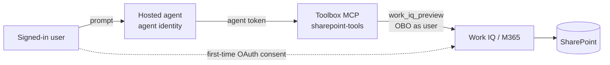

# What this sample demonstrates

A Foundry **hosted agent** that reads **SharePoint (and other Microsoft 365)** content **on behalf of
the signed-in user** via **Work IQ**, and publishes to Microsoft Teams on the Foundry auto-bot. Verified
end-to-end against a private Foundry project. Agent Framework, Responses protocol.

## How it works

The built-in `sharepoint_grounding_preview` tool can't be used here: a hosted container authenticates
to Foundry with its **own agent identity** (app-only), which SharePoint grounding rejects, and it's
unsupported once published to Teams. Instead this agent calls a **Foundry Toolbox** wrapping the
**Work IQ** SharePoint MCP tool over an **identity-passthrough** connection: Foundry performs the
On-Behalf-Of token exchange server-side, per user, so retrieval is permission-trimmed to the caller
(users sign in on first use). See
[`main.py`](agent-framework-agent-with-foundry-toolbox-responses/src/agent-framework-agent-sharepoint/main.py).



Publishing to Teams goes through the repo's APIM bridge like any hosted agent; the bridge only carries
the activity transport and is auth-transparent (consent + OBO happen server-side).

## Prerequisites

1. The **Foundry project, SharePoint site, and users are in the same Entra tenant** (no cross-tenant OBO).
2. Each user has a **Microsoft 365 Copilot license**, or the tenant has **Copilot Credits / usage-based
   billing** connected to the **Work IQ API** — otherwise retrieval returns *"unable to retrieve"* (auth
   succeeds, licensing fails). See [Copilot Credits](https://learn.microsoft.com/microsoft-365/copilot/usage-based-billing-overview-copilot-credits)
   and [Retrieval API pay-as-you-go](https://learn.microsoft.com/microsoft-365/copilot/extensibility/api/ai-services/retrieval/paygo-retrieval).
3. An existing Foundry project with a model deployment (e.g. `gpt-4.1`); **Python 3.12+**.
4. **Roles (RBAC):** **Foundry User** (developer, agent identity, and OAuth users) + **Foundry Project
   Manager** (to create the connection); a **Global Administrator** for the one-time Work IQ tenant
   setup in Option 1.
5. **Additional Azure resources:** the `sharepoint-workiq-conn` connection + `sharepoint-tools` toolbox
   — created in Option 1.

Microsoft-owned constants (use as-is):

| Item | Value |
| --- | --- |
| Work IQ resource app ID | `fdcc1f02-fc51-4226-8753-f668596af7f7` |
| `WorkIQAgent.Ask` scope ID | `0b1715fd-f4bf-4c63-b16d-5be31f9847c2` |
| Work IQ "Agent Tools" audience | `ea9ffc3e-8a23-4a7d-836d-234d7c7565c1` |

Placeholders: `<TENANT_ID>`, `<SUBSCRIPTION_ID>`, `<RESOURCE_GROUP>`, `<FOUNDRY_ACCOUNT>`, `<PROJECT>`,
`<APIM_NAME>`.

## Option 1: Azure Developer CLI (`azd`)

**Install:** `azd` 1.27.1+, then `azd ext install microsoft.foundry`; sign in with
`azd auth login --tenant-id <id>` and `az login --tenant <id>`.

### One-time Work IQ tenant setup (Global Admin)

```powershell
# Provision the Microsoft Work IQ service principal in your tenant
az ad sp create --id fdcc1f02-fc51-4226-8753-f668596af7f7
```

> Only for the optional general-M365 A2A route below: also register a single-tenant BYO Entra app, add
> the `WorkIQAgent.Ask` delegated permission (`--api fdcc1f02-... --api-permissions 0b1715fd-...=Scope`),
> `az ad sp create --id <APP_ID>`, then `az ad app permission admin-consent --id <APP_ID>`, and create a
> client secret. The core SharePoint route below needs none of this.

### Create the connection + toolbox (once)

The SharePoint connection uses `user-entra-token` (identity passthrough) — no client secret needed:

```powershell
azd ai project set https://<FOUNDRY_ACCOUNT>.services.ai.azure.com/api/projects/<PROJECT>

azd ai connection create sharepoint-workiq-conn `
  --kind remote-tool `
  --target https://agent365.svc.cloud.microsoft/agents/servers/mcp_SharePointRemoteServer `
  --auth-type user-entra-token `
  --audience ea9ffc3e-8a23-4a7d-836d-234d7c7565c1

cd agent-framework-agent-with-foundry-toolbox-responses
azd ai toolbox create sharepoint-tools --from-file toolbox.yaml
```

> **Broader M365 (optional).** For general M365 reasoning beyond SharePoint, also create a `workiq-conn`
> A2A OAuth2 connection using the BYO app + secret above — see the
> [Work IQ tool docs](https://learn.microsoft.com/azure/foundry/agents/how-to/tools/work-iq). Run it
> yourself so the secret isn't logged, and register Foundry's returned redirect URL on the BYO app.

### Initialize and deploy the agent

```powershell
$PROJECT_ID = "/subscriptions/<SUBSCRIPTION_ID>/resourceGroups/<RESOURCE_GROUP>/providers/Microsoft.CognitiveServices/accounts/<FOUNDRY_ACCOUNT>/projects/<PROJECT>"

azd ai agent init -m agent-framework-agent-with-foundry-toolbox-responses/azure.yaml `
  --project-id $PROJECT_ID --model-deployment gpt-4.1 --no-prompt --force -e sharepoint
azd env set enableHostedAgentVNext true -e sharepoint
# In the scaffolded agent.yaml, replace any ${{VAR}} with single-brace ${VAR}
azd up -e sharepoint
```

### Invoke the deployed agent

```powershell
azd ai agent invoke --new-session "Summarize the latest document in the <SiteName> SharePoint site." --timeout 120
```

The first call returns a Work IQ **OAuth consent** URL — sign in as a licensed user with access to the
site, then re-invoke. To confirm per-user trimming, ask as a user *without* access to a document and
verify it isn't returned.

## Option 2: VS Code (Foundry Toolkit)

1. Install the **Foundry Toolkit** VS Code extension and `az login`.
2. Open `agent-framework-agent-with-foundry-toolbox-responses/`, run locally (`azd ai agent run` or
   `python main.py`, port 8088), and chat via **Foundry Toolkit: Open Agent Inspector**.
3. Run **Foundry Toolkit: Deploy Hosted Agent** to build, register the version, and assign RBAC.

(The tenant setup + connection + toolbox from Option 1 are still required first.)

## Publish to Teams

The Foundry auto-bot is preserved; publish through the repo's APIM bridge (the same user consent + OBO
happen server-side, unchanged from the playground):

```powershell
./scripts/Publish-AgentToTeams.ps1 -ResourceGroup <RESOURCE_GROUP> `
  -AgentName agent-framework-agent-sharepoint `
  -ProjectEndpoint https://<FOUNDRY_ACCOUNT>.services.ai.azure.com/api/projects/<PROJECT> -ApimName <APIM_NAME>
```

Open the agent in Teams, complete the first-time sign-in/consent, and ask. If your agent subnet uses
default-deny egress, allow `agent365.svc.cloud.microsoft`, `workiq.svc.cloud.microsoft`,
`login.microsoftonline.com`, `*.consent.azure-apim.net`, `graph.microsoft.com`.

## Troubleshooting

| Symptom | Cause / fix |
| --- | --- |
| `AppOnly OBO tokens not supported` / `No CustomKeys connection found` | You're using the SharePoint grounding tool, not the Work IQ toolbox. Use this route. |
| Agent returns no tools | Toolbox name/`TOOLBOX_NAME` mismatch, or no default version. Check `azd ai toolbox show sharepoint-tools`. |
| Consent URL every call | User hasn't consented yet, or the refresh token expired. Complete the consent URL. |
| `User does not have valid license` | Assign a Microsoft 365 Copilot license or enable Copilot Credits billing. |
| 401 / cross-tenant | The Foundry project and M365/SharePoint must be in the same tenant. |
| Container fails readiness on deploy | Ensure `enableHostedAgentVNext=true` and `AZURE_AI_MODEL_DEPLOYMENT_NAME` matches a real deployment. |

## Next steps

- [Connect agents to Microsoft 365 with Work IQ](https://learn.microsoft.com/azure/foundry/agents/how-to/tools/work-iq)
- [Use a toolbox with a hosted agent](https://learn.microsoft.com/azure/foundry/agents/how-to/tools/use-toolbox-hosted-agent) · [How toolbox authentication works](https://learn.microsoft.com/azure/foundry/agents/how-to/tools/tool-authentication)
- Sibling routes: [`../databricks-agent`](../databricks-agent/README.md) · [`../sharepoint-agent-copilot-retrieval`](../sharepoint-agent-copilot-retrieval/README.md)
- [Usage-based billing & Copilot Credits](https://learn.microsoft.com/microsoft-365/copilot/usage-based-billing-overview-copilot-credits)
