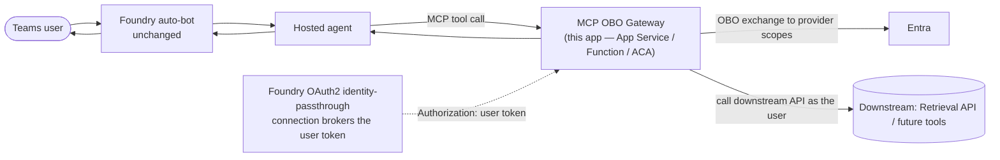

# MCP OBO Gateway — a generic per‑user tool gateway for Foundry hosted agents

A **lightweight, provider‑pluggable MCP server** that gives a **hosted** Foundry agent **per‑user
(OBO)** access to downstream APIs while **keeping the Foundry auto‑published Teams bot** (no custom
bot to build or maintain).

It uses the **same mechanism Work IQ and Databricks Genie already use** in this repo: an **OAuth2
identity‑passthrough** connection where **Foundry brokers the user's token server‑side** and forwards
it to this MCP server. The gateway then does the **On‑Behalf‑Of** exchange and calls the downstream API
as the user.

> **Generic by design.** Ships with a **Copilot Retrieval API** (SharePoint) provider, but the OBO +
> MCP transport is downstream‑agnostic. Any tool that **lacks Foundry server‑side OBO** can be added as
> a small **provider** module — no auth or MCP plumbing to write.

## Why this approach
- **Keeps the Foundry auto‑published Teams bot** — no bot code, no Teams manifest, no sideload.
- **Foundry brokers the user token** (OAuth2 passthrough); the gateway only does the OBO exchange.
- **One gateway, many providers** — reused across agents and tools, not configured per agent.

## How it works



1. Foundry forwards the **user's OAuth token** to the gateway as `Authorization` (identity passthrough).
2. The gateway **verifies** that token (audience = gateway app, tenant issuer, `access_as_user` scope)
   before any tool runs — a token minted for another resource is rejected.
3. On each tool call it does **OBO** → a downstream token for the scopes that provider needs.
4. The provider calls the downstream API **as the user** (permission-trimmed) and returns results.

> **Validated by peers.** [karpikpl/foundry-keycloak-passthrough](https://github.com/karpikpl/foundry-keycloak-passthrough)
> proves Foundry's OAuth2 passthrough delivers a per-user token to a **custom FastMCP server** (its
> `agent_v2` uses exactly the wiring below). [alisoliman/mcp-obo](https://github.com/alisoliman/mcp-obo)
> is the reference for the delegated-identity pattern (verify the inbound token, then OBO). This
> gateway adopts both lessons: **verify, then exchange**.

## Layout
```
mcp-obo-gateway/server/
├── app.py                       ← FastMCP server; verifies token, wires OBO + loads providers
├── obo.py                       ← generic On-Behalf-Of exchange (MSAL)
├── config.py
├── providers/
│   ├── base.py                  ← Provider contract
│   ├── whoami.py                ← diagnostic: echoes the resolved user identity (no downstream)
│   ├── copilot_retrieval.py     ← reference provider (SharePoint, site-scoped)
│   └── __init__.py              ← loads enabled providers
├── requirements.txt · Dockerfile · .env.example
```

## Add a new downstream tool (the generic part)
Create `providers/<your_tool>.py`:
```python
name = "your_tool"

def register(mcp, exchange):
    @mcp.tool(name="do_thing", description="...")
    async def do_thing(arg: str) -> dict:
        token = await exchange(["<downstream/scope>"])   # gateway does the OBO for you
        # ... call the downstream API with `token` as the user ...
        return {...}
```
Then add it to `ENABLED_PROVIDERS`. That's it — no auth/MCP code. This is what makes it work for
**future tools that don't have Foundry server‑side OBO**.

## Setup

### 1. Gateway Entra app (confidential client, for OBO)
Register an Entra app for the gateway:
- **Expose an API** with a scope (e.g. `access_as_user`) — Foundry requests this scope; the token it
  gets has the gateway as its audience so the gateway can OBO it.
- Add the **delegated downstream permissions** each provider needs (Retrieval API →
  `Files.Read.All`, `Sites.Read.All`), grant **admin consent**.
- Create a **client secret**.
Set `GATEWAY_TENANT_ID` / `GATEWAY_CLIENT_ID` / `GATEWAY_CLIENT_SECRET`.

### 2. Deploy the gateway
Host `server/` anywhere **Foundry can reach**. The MCP endpoint is served at `…/mcp/`.

> **Network placement (important for private Foundry).** Foundry's runtime makes the outbound MCP
> call to the gateway, so the gateway must be reachable from the Foundry project's egress — either a
> public endpoint the connection can call (App Service / Container Apps / Function), or a host in / peered
> to the Foundry VNet. This is the same reachability the Work IQ / Databricks Genie MCP connections
> rely on. The gateway also needs outbound access to **Entra + Microsoft Graph**. Note this is a
> **separate** path from the APIM bridge that carries Teams↔private‑Foundry activity traffic — the two
> operate at different layers and don't overlap.

### 3. Foundry OAuth2 identity‑passthrough connection
Create a Foundry **MCP connection** (same shape as `AzureDatabricksGenieOBO` / `workiq-conn`):
- `server_url` = `https://<gateway-host>/mcp/`
- **OAuth2** with Entra endpoints:
  `https://login.microsoftonline.com/<tenant>/oauth2/v2.0/authorize` and `.../token`
- client id/secret of the gateway app, scope `api://<gateway-app-id>/access_as_user`.
Add it to your hosted agent's toolbox. On first use, the user gets a one‑time **consent card** (in
Teams, via the auto‑bot) — exactly like Databricks Genie today.

The agent side is just an MCP tool pointed at the connection (from karpikpl's `agent_v2`):
```python
mcp_tool = MCPTool(
    server_label="obo_gateway",
    server_url="https://<gateway-host>/mcp",
    project_connection_id="<connection-name>",   # enables OAuth identity passthrough
    require_approval="always",                    # user approves each tool call
)
```
Handle the `oauth_consent_request` output item (open its `consent_link`) on first run, then the
`mcp_approval_request` loop — the same pattern the Databricks/Work IQ agents already use.

## Test
Ask the agent to **call `whoami`** first — it returns your name/upn/oid with **no downstream call**,
proving the passthrough delivers a per‑user token. Then ask a SharePoint question for the real
`sharepoint_retrieve` path. Diagnostics: `OBO failed … (AADSTS65001)` (consent missing — grant admin
consent on the gateway app), `403 … Files.Read.All/Sites.Read.All` (gateway app missing Graph perms),
`403 … valid license` (user not Copilot‑licensed / no Retrieval paygo — **licensing gate, unchanged**).

## Production hardening (from the peer samples)
- **Secret-less (implemented).** Leave `GATEWAY_CLIENT_SECRET` empty and set `GATEWAY_MI_CLIENT_ID`
  to a user-assigned managed identity. Add a **federated credential** on the gateway app that trusts
  that MI (issuer = the MI's OIDC issuer, subject = the MI), and the gateway uses the MI token as its
  client assertion for OBO — no secret stored (the `alisoliman/mcp-obo` pattern, via MSAL's
  regenerative `client_assertion` callback).
- **Verify tokens** — already on (`VERIFY_TOKENS=true`): audience/issuer/`access_as_user` scope.
- **OBO caching** — MSAL caches by assertion hash, so repeat calls in a session don't re-hit Entra.
- **Origin/DNS-rebinding check** — add if you expose the endpoint to browsers (alisoliman ships one).

## Caveats
- Downstream **licensing still applies** (Retrieval API → Copilot license/paygo).
- Preview: MCP tools + OAuth2 connections in Foundry are preview.
- This is a starting point, not a hardened deployment — see **Production hardening** above.
