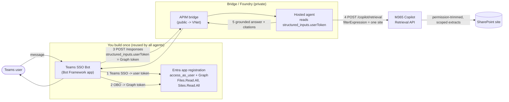
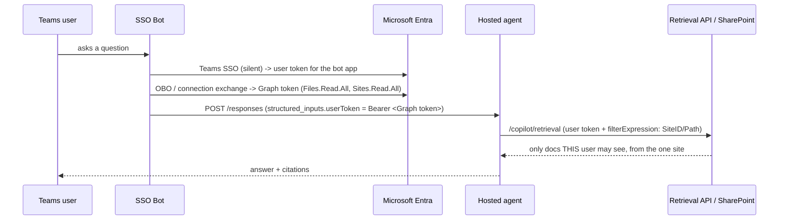

# Hosted SharePoint agent in Teams — per‑user, site‑scoped (Copilot Retrieval API + Teams SSO)

The end‑to‑end design for letting a **hosted Foundry agent** answer from **one SharePoint site**, in
**Microsoft Teams**, **permission‑trimmed to each user** — the combination no single built‑in tool
delivers. It pairs the hosted **[Option C](./sharepoint-access-via-foundry-agents.md) agent**
([`sharepoint-agent-obo-retrieval`](../foundryagents/hostedagent/sharepoint-agent-obo-retrieval/README.md))
with a **Teams SSO bot** that supplies the user's token.

## Architecture

## Token flow

## Components

| Component | Role | Effort |
| --- | --- | --- |
| **Teams SSO Bot** | Teams SSO → user token, OBO → Graph token, call agent `/responses` with the token, relay reply | build **once**, reuse for all agents |
| **Entra app registration** | `access_as_user` scope + delegated **`Files.Read.All` + `Sites.Read.All`** + admin consent + secret | build **once** |
| **APIM bridge** | forwards the `/responses` body (with the token) to private Foundry | existing — minor route/policy |
| **Hosted agent** | reads `structured_inputs.userToken`, calls the Retrieval API with a site‑scoped `filterExpression`, answers with citations | ✅ built ([sample](../foundryagents/hostedagent/sharepoint-agent-obo-retrieval/README.md)) |
| **Copilot Retrieval API** | queries SharePoint **on behalf of the user** → permission‑trimmed | Microsoft service |

## Why this is the only route that gives all three
- **Per‑user permission trimming** ✅ — retrieval runs on the **user's token** (OBO).
- **Scope to one SharePoint site** ✅ — `filterExpression: SiteID:"…"` / `Path:"…/sites/<Site>/"`.
- **Hosted container + Teams** ✅ — the bot injects the user token via `structured_inputs`, which
  **reaches a hosted container intact** (verified in this repo).

## Requirements / costs to call out
- **A Teams SSO bot is mandatory.** The Foundry auto‑published Teams bot can't do this — it never
  produces a user token, and it speaks the activity protocol, not `/responses`. This bot **replaces**
  the auto‑bot as the Teams entry point.
- **Licensing:** each user needs a **Microsoft 365 Copilot** license, or the tenant's **Retrieval API
  pay‑as‑you‑go** (which itself requires ≥1 Copilot license). *This gate does not move.*
- **Reusable:** build the bot + Entra app **once**; onboard new agents by **config** (their
  `/responses` URL + site scope), not new auth code.
- **Preview:** the Retrieval API / SharePoint tool pieces are in preview.

## The trade‑off in one line
Exact **per‑user trimming + single‑site scoping in Teams from a hosted agent**, at the cost of **one
SSO bot + Copilot licensing**. If either is unacceptable, use **prompt agent + SharePoint tool**
(keeps the auto‑bot, needs Copilot license) or **Azure AI Search M365 indexer** (no bot/license,
preview ACL trimming). Full comparison: [sharepoint-access-via-foundry-agents.md](./sharepoint-access-via-foundry-agents.md).

## Build it
- Hosted agent: [`sharepoint-agent-obo-retrieval`](../foundryagents/hostedagent/sharepoint-agent-obo-retrieval/README.md)
- Teams SSO bot: [`sharepoint-agent-obo-retrieval/bot`](../foundryagents/hostedagent/sharepoint-agent-obo-retrieval/bot/README.md)
