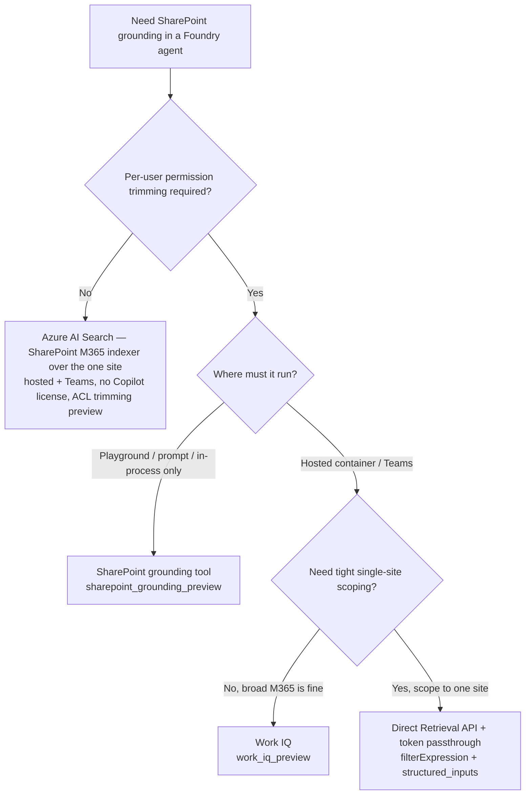

# Accessing SharePoint data from Microsoft Foundry agents

A practical comparison of the ways an agent built on **Microsoft Foundry Agent Service** can ground
answers on **SharePoint** content — and the trade‑offs that actually decide which one you can use:
**identity/OBO, per‑user permission trimming, source scoping, hosted/Teams support, and licensing.**

> Status legend: ✅ works · ❌ not supported · ⚠️ conditional · 🧪 preview · 🔧 you build it
>
> Findings marked **(verified in this repo)** were tested end‑to‑end against a private Foundry
> project; see the linked sample folders.

---

## TL;DR — pick by your hardest constraint

| Your hardest requirement | Use this |
| --- | --- |
| Runs only in **playground / prompt agent**, scoped to a site, per‑user trimmed | **SharePoint grounding tool** ([`sharepoint-agent-retrievalapi`](../foundryagents/hostedagent/sharepoint-agent-retrievalapi/README.md)) |
| **Hosted agent + Teams**, per‑user trimmed, broad M365 (no tight scoping) | **Work IQ** ([`sharepoint-agent-workiq`](../foundryagents/hostedagent/sharepoint-agent-workiq/README.md)) |
| **Hosted agent + Teams**, per‑user trimmed, **AND scoped to one site** | **Direct Retrieval API + token passthrough** ([`sharepoint-agent-obo-retrieval`](../foundryagents/hostedagent/sharepoint-agent-obo-retrieval/README.md), Option C) |
| **Hosted agent + Teams**, scoped, **no Copilot licensing**, per‑user trim not required | **Azure AI Search — SharePoint M365 indexer** over the one site (Option E1) |

---

## The two axes that decide everything

Every option below is really answering two independent questions:

1. **Whose identity calls SharePoint?**
   - **User (OBO / delegated)** → answers are **permission‑trimmed** to that user. Required for
     the built‑in SharePoint tool and the Retrieval API.
   - **App (managed identity / service principal)** → app‑only. **Rejected** by the SharePoint
     grounding tool and the Retrieval API.
2. **How narrowly can you scope the source?**
   - Whole M365 context (Work IQ) → noisy, can hallucinate for a focused KB.
   - One site/folder (SharePoint tool connection) or precise KQL filter (Retrieval API) → clean.

The friction is that the runtime **surface** determines which identity you get:

| Runtime | Identity the tool sees |
| --- | --- |
| Playground **prompt agent** | signed‑in **user** (OBO) |
| **In‑process** Agent Framework agent (`FoundryChatClient`, `az login`) | signed‑in **user** (OBO) |
| **Deployed hosted‑container** agent | the agent's **managed identity** (app‑only) |
| Prompt agent **published to Teams** | still the **user** (OBO flows through) |

**(verified in this repo)** The same SharePoint tool + connection **reaches retrieval** in‑process
(user identity) but **fails at connection resolution** from a hosted container (managed identity =
app‑only). See [`sharepoint-agent-hosted`](../foundryagents/hostedagent/sharepoint-agent-hosted/README.md).

---

## Options matrix

| # | Option | Scope to one site/folder | Per‑user permission trim | Prompt / in‑process | Hosted container | Teams | Licensing | You build |
| --- | --- | --- | --- | --- | --- | --- | --- | --- |
| A | **SharePoint grounding tool** (`sharepoint_grounding_preview`) 🧪 | ✅ (connection = site/folder URL) | ✅ (OBO) | ✅ | ❌ (app‑only rejected) | ❌ | M365 Copilot license **or** Retrieval API paygo | none |
| B | **Work IQ** (`work_iq_preview`) 🧪 | ❌ broad M365 | ✅ (OBO) | ✅ | ✅ | ✅ | M365 Copilot license **or** Work IQ paygo | connection + BYO app |
| C | **Direct Retrieval API + token passthrough** (`POST /copilot/retrieval`) 🧪 | ✅✅ KQL `filterExpression` (path/SiteID/FileType/…) | ✅ (OBO) | ✅ | ✅ ⚠️ (with token plumbing) | ✅ ⚠️ | M365 Copilot license **or** Retrieval API paygo | 🔧 MCP/API + token passthrough |
| D | **SharePoint remote MCP** (`UserEntraToken` passthrough) 🧪 | ✅ | ✅ (OBO) | ✅ | ❌ (container can't supply user Entra token) | ❌ | Copilot / paygo | connection |
| E1 | **Azure AI Search — SharePoint M365 *indexer*** 🧪 | ✅✅ (index only that site) | ⚠️ only via ACL ingestion (preview, basic) | ✅ | ✅ | ✅ | **none (no Copilot)** | 🔧 indexer + index |
| E2 | **Azure AI Search — *remote SharePoint* knowledge source** 🧪 | ✅✅ (`filterExpression`) | ✅ (live OBO) | ✅ | ✅ ⚠️ (needs user token) | ✅ ⚠️ | **Copilot / paygo** | knowledge source (wraps Retrieval API) |

---

## Option details

### A. SharePoint grounding tool — `sharepoint_grounding_preview` 🧪
The built‑in Foundry SharePoint tool, backed by the **Microsoft 365 Copilot Retrieval API**.
Scope is set by the **connection** (a site or folder URL). Runs **on behalf of the signed‑in user**,
so results are permission‑trimmed.

- **Great for:** playground / prompt agents and in‑process agents that run as the user.
- **Blocked for:** deployed **hosted containers** (managed identity = app‑only → rejected) and
  **Teams** (documented as unsupported).
- **Sample:** [`sharepoint-agent-retrievalapi`](../foundryagents/hostedagent/sharepoint-agent-retrievalapi/README.md)
  (the docs' "Hosted agents" pivot = an *in‑process* agent, still under the user's identity).
- **(verified in this repo):** in‑process as a licensed user → grounded answer + citations; as an
  unlicensed user → `403 User does not have valid license`.

### B. Work IQ — `work_iq_preview` 🧪
An A2A tool that reasons over the user's **Microsoft 365** context via an **OAuth2
identity‑passthrough** connection. Foundry brokers the per‑user token **server‑side**, so it works
from a **hosted container and through Teams**.

- **Great for:** hosted/Teams agents that need per‑user M365 grounding.
- **Limitation (customer‑reported):** **no per‑site/source scoping** — it reasons over broad M365,
  which causes noise/hallucination for a single‑site knowledge base.
- **Sample:** [`sharepoint-agent-workiq`](../foundryagents/hostedagent/sharepoint-agent-workiq/README.md)

### C. Direct Retrieval API + token passthrough — `POST /copilot/retrieval` 🧪 🔧
Call the Retrieval API yourself and pass the **user's token** into the agent at request time (Foundry
`structured_inputs` → templated tool header → your MCP/API). This is the **only** option that gives
**tight scoping AND per‑user trimming AND hosted/Teams** at once.

- **Scoping:** `filterExpression` (KQL) is more granular than any connection — e.g. pin to one site:
  ```jsonc
  POST /copilot/retrieval
  {
    "queryString": "<user question>",
    "dataSource": "sharePoint",
    "filterExpression": "path:\"https://contoso.sharepoint.com/sites/PolicyKB/\"",
    "maximumNumberOfResults": 10
  }
  ```
  Also supports `SiteID`, `FileType`, `Title`, `Author`, `LastModifiedTime`, `InformationProtectionLabelId`, …
- **Identity:** delegated only (**Application = Not supported**). The user's token must be *carried in*
  (client/bot acquires it via Teams SSO / OAuth, forwards it via `structured_inputs`); the container
  never gets an exchangeable user token on its own.
- **Pattern reference:** per‑user token passthrough into a Foundry tool via `structured_inputs` +
  a pure‑placeholder header (`Authorization: {{userToken}}`).
- **Shape for the Teams path:** `Teams → Bot (Teams SSO → user token) → APIM → Foundry (hosted
  agent reads structured_inputs.userToken) → /copilot/retrieval (filterExpression) → SharePoint`.
- **Status:** ✅ **transport verified in this repo** — a deployed hosted container receives
  `structured_inputs` (the user token arrives intact). Sample:
  [`sharepoint-agent-obo-retrieval`](../foundryagents/hostedagent/sharepoint-agent-obo-retrieval/README.md).
  (Downstream still needs Retrieval API license/paygo.)

### D. SharePoint remote MCP — `UserEntraToken` passthrough 🧪
A remote MCP SharePoint server that expects the caller's **delegated Entra user token**. Works for
prompt/direct callers but a **hosted container can't supply that token**, so `tools/list` fails with
*"requires a delegated Microsoft Entra user context."* Kept for reference / non‑hosted callers.

### E. Azure AI Search — **two very different options** (don't confuse them) 🧪
Azure AI Search offers *two* SharePoint paths that look similar but are opposites. Picking the wrong
one defeats the purpose.

**E1 — SharePoint in Microsoft 365 *indexer*** ([docs](https://learn.microsoft.com/azure/search/search-how-to-index-sharepoint-online))
- **Crawls/indexes** the site content **into an AI Search index** (data is copied).
- Runs under an **app identity** — **no user token, no SSO, no Copilot license**. Works on the
  **existing Foundry auto‑bot**.
- **Scope:** index only that site/library/folder (`includeLibrariesInSite`/`includeFolder`).
- **Per‑user trimming:** only via **ACL ingestion** — *"limited… basic level… in preview."* You filter
  by the user's groups at query time (resolve groups from the `user_id` Foundry passes the container).
- **Choose when:** you want to **avoid the SSO bot and Copilot licensing**, and can accept
  approximate, index‑based trimming (and content replication + refresh to manage). **This is the
  "AI Search that keeps things simple" option.**

**E2 — *Remote SharePoint* knowledge source** ([docs](https://learn.microsoft.com/azure/search/agentic-knowledge-source-how-to-sharepoint-remote))
- **No index.** Queries SharePoint **live** via the **Copilot Retrieval API** — it is essentially
  **Option C wrapped as an AI Search knowledge source**.
- **Per‑user trimming:** ✅ exact/live — **but requires the end user's token**
  (`x-ms-query-source-authorization`), and a **Copilot license**. Same identity/SSO problem as C.
- **Scope:** `filterExpression` (SiteID/Path/FileType/…), same KQL as the Retrieval API.
- **Choose when:** you've **accepted Option C** (user token + Copilot license) and want a managed
  wrapper instead of hand‑rolling `/copilot/retrieval`. It does **not** avoid the SSO bot for Teams.

**The decision in one line:** exact per‑user trimming ⇒ you pay in **token/SSO + Copilot license**
(E2 / C); no token/SSO/license ⇒ you pay in **preview, approximate ACL trimming + a content copy** (E1).

---

## Licensing (applies to A, B, C, D, and E2 — but NOT E1)

The SharePoint tool, Work IQ, and the Retrieval API are all gated on **Microsoft 365 Copilot
entitlement of the calling user**:

- A per‑user **Microsoft 365 Copilot** license, **or**
- **Pay‑as‑you‑go** for the relevant service (M365 admin center → Copilot → Billing & usage →
  Pay‑as‑you‑go). Note there are **separate meters** — e.g. *"Microsoft 365 Copilot Retrieval API"*
  (for the SharePoint tool / Option C) vs *"SharePoint agents"* vs *"Work IQ API"*. Connect the
  **right** service, scope it to the user/group, and allow ~2h to propagate (the first call may fail).
- **Retrieval API paygo prerequisite:** the tenant must have **≥1 Microsoft 365 Copilot license**
  before enablement and during use.

**Azure AI Search (Option E) needs none of this** — it's the way to avoid Copilot licensing entirely,
at the cost of built‑in per‑user trimming.

---

## Decision guide



For the common ask — **hosted/Teams + per‑user trimming + scoped to one site** — the answer is
**Option C** (Work IQ can't scope; the SharePoint tool can't go hosted/Teams).

---

## References
- SharePoint tool for Foundry Agent Service: https://learn.microsoft.com/azure/foundry/agents/how-to/tools/sharepoint
- Microsoft 365 Copilot Retrieval API: https://learn.microsoft.com/microsoft-365/copilot/extensibility/api/ai-services/retrieval/copilotroot-retrieval
- Retrieval API pay‑as‑you‑go: https://learn.microsoft.com/microsoft-365/copilot/extensibility/api/ai-services/retrieval/paygo-retrieval
- Foundry toolbox / supported tools: https://learn.microsoft.com/azure/foundry/agents/concepts/toolbox-overview
- Agent identity concepts (delegated / passthrough): https://learn.microsoft.com/azure/foundry/agents/concepts/agent-identity

_Samples in this repo:_
[`sharepoint-agent-retrievalapi`](../foundryagents/hostedagent/sharepoint-agent-retrievalapi/README.md) ·
[`sharepoint-agent-workiq`](../foundryagents/hostedagent/sharepoint-agent-workiq/README.md) ·
[`sharepoint-agent-hosted`](../foundryagents/hostedagent/sharepoint-agent-hosted/README.md)
